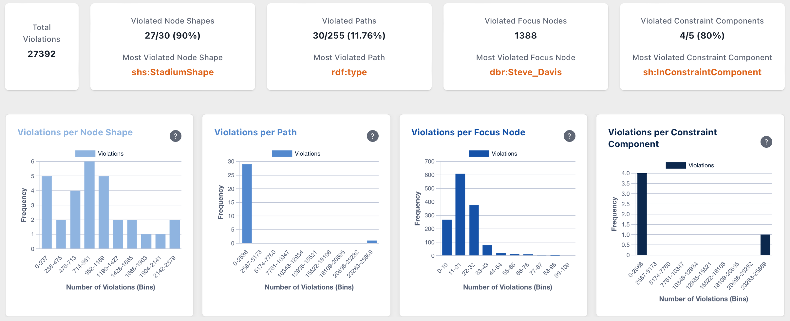
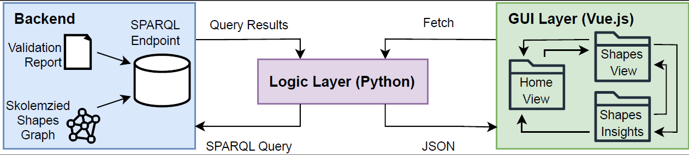

# SHACL Dashboard

A comprehensive visualization and analysis tool for SHACL validation results. SHACL Dashboard helps data engineers and knowledge graph maintainers understand, analyze, and address constraint violations in RDF data.



## Overview

The SHACL Dashboard provides an interactive web interface for exploring and analyzing SHACL validation results. It connects to a Virtuoso RDF database containing SHACL shapes and validation reports, offering detailed statistics, visualizations, and insights into constraint violations.

## Key Features

- **Interactive Dashboards**: Visualize validation metrics with charts and tables
- **Detailed Analysis**: Examine violations by shapes, paths, focus nodes, and constraint types
- **Comprehensive Statistics**: View distributions and patterns in validation results
- **RESTful API**: Access all validation data programmatically through the API
- **Shape-Specific Analysis**: Dive deep into individual shape validation patterns

## Architecture

SHACL Dashboard follows a client-server architecture:

- **Frontend**: Vue.js 3 single-page application with Vuetify and Chart.js
- **Backend**: Flask RESTful API connecting to Virtuoso database
- **Database**: Virtuoso RDF triple store containing shapes and validation reports



## Quick Start

### Prerequisites

- Docker and Docker Compose (recommended)
- Alternatively: Node.js 18+, Python 3.8+, and Virtuoso

### Using Docker (Recommended)

```bash
git clone https://github.com/yourusername/shacl-dashboard.git
cd shacl-dashboard
docker-compose up -d
```

The dashboard will be available at http://localhost:80

### Manual Setup

1. Start Virtuoso:

```bash
# Start Virtuoso with your preferred method
# Example using Docker:
docker run --name virtuoso -p 8890:8890 -p 1111:1111 -d openlink/virtuoso-opensource-7
```

Ensure Virtuoso is running and accessible at http://localhost:8890/sparql

2. Set up the Backend:

```bash
cd backend
python -m venv venv
source venv/bin/activate  # On Windows: venv\Scripts\activate
pip install -r requirements.txt
# You might need to run with admin privileges since it uses port 80
sudo python app.py  # On Windows: run as Administrator
```

3. Set up the Frontend:

```bash
cd frontend
npm install
npm run dev
```

The frontend will be available at http://localhost:5173

## Usage

### Data Setup

Currently, the dashboard requires manual configuration of RDF data in Virtuoso. The graph URIs used by the application are:

- Shapes Graph: `http://ex.org/ShapesGraph`
- Validation Report: `http://ex.org/ValidationReport`

To load data, you have two options:

#### Option 1: Using the virtuoso_service.py module directly

The backend includes direct functions for loading data in `virtuoso_service.py`:

```python
# Example usage from Python code
from functions.virtuoso_service import load_graphs

# Load graphs directly
load_graphs("path/to/data/directory", "shapes_file.ttl", "validation_report.ttl")
```

#### Option 2: Using Virtuoso's web interface

1. Access the Virtuoso Conductor at http://localhost:8890/conductor
2. Log in with the default credentials
3. Navigate to "Linked Data" → "Quad Store Upload"
4. Upload your SHACL shapes file to the graph `http://ex.org/ShapesGraph`
5. Upload your validation report file to the graph `http://ex.org/ValidationReport`


### Navigation

The SHACL Dashboard offers two main views:

1. **Home View**
   - Overview of all validation statistics
   - Summary charts showing violation distributions
   - Key metrics on shapes, paths, and focus nodes
   - Detailed validation report table

2. **Shapes View**
   - Comprehensive analysis of individual shapes
   - Shape-specific violation statistics
   - Property shape breakdowns
   - Constraint component analysis
   - Detailed view of affected focus nodes

Use the navigation menu to switch between these views.

## Project Structure

```plaintext
shacl-dashboard/
├── backend/                  # Backend server
│   ├── app.py                # Main application file
│   ├── requirements.txt       # Python dependencies
│   └── ...                    # Other backend files
├── frontend/                 # Frontend application
│   ├── src/                  # Source files
│   ├── public/                # Public assets
│   ├── package.json           # Node.js dependencies
│   └── ...                    # Other frontend files
├── docs/                     # Documentation files
│   ├── images/                # Images for documentation
│   └── ...                    # Other documentation files
├── docker-compose.yml        # Docker Compose configuration
└── README.md                 # This README file
```

## Troubleshooting

- **500 Internal Server Error**: Check the backend logs for traceback information. Common issues include database connection errors and missing environment variables.
- **CORS Errors**: Ensure the frontend and backend are running on the correct ports and that the backend allows requests from the frontend's origin.
- **Data Upload Issues**: Verify the named graphs in Virtuoso and ensure the SHACL shapes and validation reports are correctly loaded.

## Contributing

Contributions are welcome! Please follow these steps:

1. Fork the repository
2. Create a new branch: `git checkout -b feature/YourFeature`
3. Make your changes
4. Commit your changes: `git commit -m 'Add some feature'`
5. Push to the branch: `git push origin feature/YourFeature`
6. Submit a pull request

Please ensure your code follows the project's coding standards and includes appropriate tests.

## License

This project is licensed under the GNU Affero General Public License v3.0 - see the [LICENSE](LICENSE) file for details.

## Acknowledgments

- [SHACL](https://www.w3.org/TR/shacl/) - Shapes Constraint Language
- [Virtuoso](https://virtuoso.openlinksw.com/) - RDF Database
- [Flask](https://flask.palletsprojects.com/) - Python web framework
- [Vue.js](https://vuejs.org/) - JavaScript framework
- [Chart.js](https://www.chartjs.org/) - JavaScript charting library
- [Vuetify](https://vuetifyjs.com/) - Material Design component framework for Vue.js
